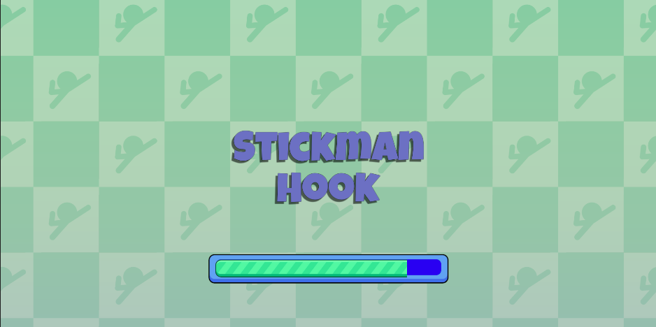
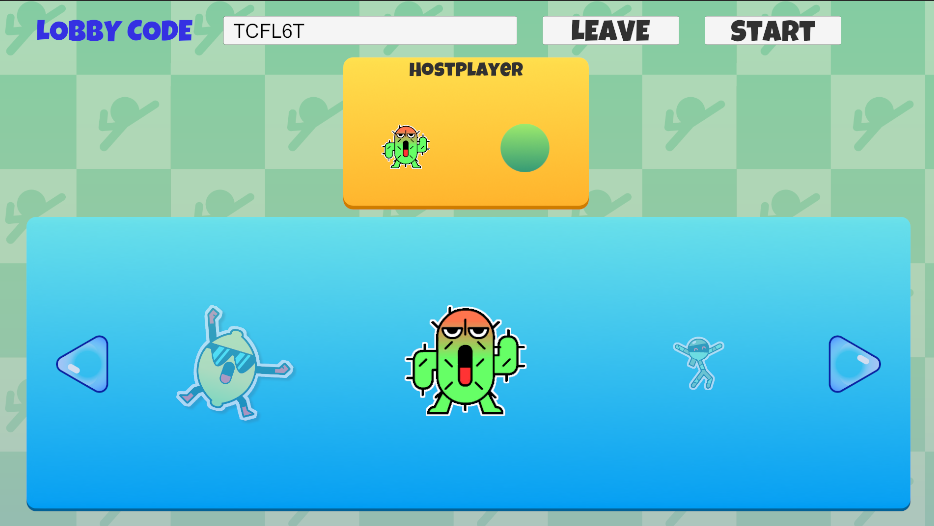
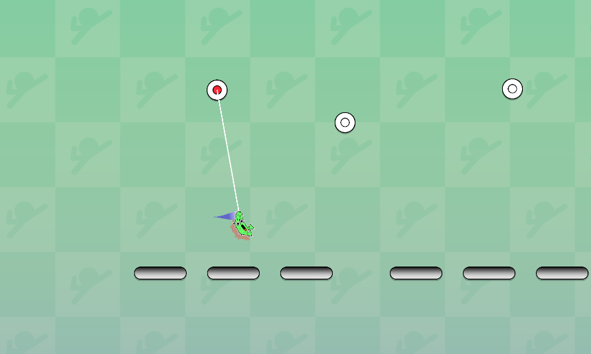
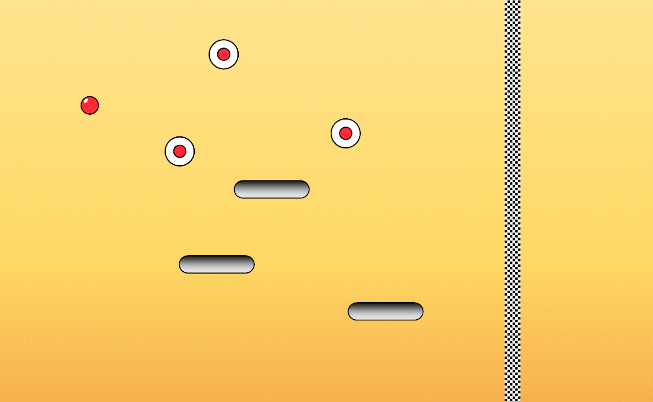

# Giới thiệu cơ bản
- StickmanHook thuộc thể loại game HuperCasual
- Game được thiết kế xoay quanh việc người chơi điều khiển nhân vật để đu dây qua các chốt (joint) hoặc nảy trên các platform để khám phá màn chơi
- Điểm nổi bật của dự án là game có hỗ trợ chức năng điều khiển bằng cử chỉ tay sử dụng thư viện CvZone với framework Mediapipe
- Game cũng hỗ trợ chế độ multiplayer, người chơi tạo phòng và gửi mã phòng cho bạn bè để tham gia sử dụng Netcode
- Game đang trong giai đoạn phát triển chế độ đẩy người chơi trong cùng 1 phòng vào màn chơi.

    
    

  

# Game Mechanic (Core Loop)
## Action (Core Mechanic)
- Kịch bản chuẩn (chế độ UI)
	1. Người chơi click Host để tạo 1 phòng với chế độ Host
    2. Hệ thống tạo 1 phòng cho người chơi với tên của người chơi là HostPlayer với giao diện chọn nhân vật có các nút mũi tên để đổi nhân vật
    3. Người chơi sử dụng nút mũi tên trái, phải để chọn nhân vật sau đó click Start
    4. Hệ thống đẩy người chơi vào màn chơi với việc tạo nhân vật như người chơi đã chọn
    5. Người chơi nhấn giữ để tạo dây với chốt gần nhất có thể đu (có 1 đường viền nét đứt bao quanh) và đu hoặc thả rơi tự do vào 1 platform để bật nảy
    6. Người chơi di chuyển đến khi nào chạm vạch đích thì kết thúc màn chơi
- Kịch bản chuẩn (chế độ AI)
    1. Người chơi click Host để tạo 1 phòng với chế độ Host
    2. Hệ thống tạo 1 phòng cho người chơi với tên của người chơi là HostPlayer với giao diện chọn nhân vật có các nút mũi tên để đổi nhân vật
    3. Người chơi sử dụng ngón út hoặc ngón cái để điều khiển thay đổi nhân vật tùy vào hướng của mỗi ngón
    4. Hệ thống thay đổi nhân vật được chọn theo hướng ngón tay của người chơi
    5. Khi đã chọn xong nhân vật, người chơi giơ đồng thời 2 ngón trỏ và giữa
    6. Hệ thống nhận diện cử chỉ bắt đầu chơi game và đẩy người chơi vào màn chơi
    7. Người chơi nắm đồng thời cả 5 ngón của 1 bàn tay vào để đu vào chốt hoặc duỗi đồng thời 5 ngón của bàn tay để rơi tự do
    8. Người chơi di chuyển đến khi nào chạm vạch đích thì kết thúc màn chơi
- Win: Hệ thống kiểm tra liệu người chơi đã chạm vào vạch đích chưa
- Loss: Hệ thống kiểm tra vị trí của người chơi khi không đu dây và xử thua trong các trường hợp sau
	- Nếu vị trí theo trục x của người chơi < -10
    - Nếu vị trí theo trục y của người chơi < -5

# Core Pillar
## Nhận diện cử chỉ tay
1. Mô tả : Xây dựng chương trình nhận diện cử chỉ tay sử dụng thư viện cvZone và sử dụng giao thức UDP qua localhost để truyền tải các thông điệp tương ứng với cử chỉ của người dùng đến ứng dụng game và tiến hành kích hoạt sự kiện tương ứng.
2. Chương trình nhận diện cử chỉ
    - Sử dụng OpenCv để truy cập vào camera sau đó sử dụng thư viện cvZone để phân tích khung hình và bắt lấy cử chỉ tương ứng để gửi thông điệp với kịch bản như sau:
        - Ngón trỏ tay trái hoặc ngón út tay phải → RIGHT
        - Ngón trỏ tay phải hoặc ngón út tay trái → LEFT
        - Đồng thời ngón trỏ và ngón giữa → PLAY
        - Nắm bàn tay → SPACE_DOWN
        - Duỗi bàn tay → SPACE_UP
    - Chương trình được build lại thành 1 file thực thi .exe
3. Ứng dụng game nhận thông điệp
    - Đặt file thực thi .exe vừa build vào Assets/StreamingAssets
    - Khởi tạo tiến trình chạy ngầm cho chương trình nhận diện cử chỉ và đảm bảo tiến trình này hoàn toàn được hủy khi thoát ứng dụng game
    - Khởi tạo 1 vòng lặp vô hạn để lắng nghe thông điệp được gửi từ chương trình nhận diện cử chỉ qua localhost và kích hoạt sự kiện
        - Lưu ý: Unity không cho phép kích hoạt API của Unity bên ngoài main thread
        - Giải pháp: Sử dụng 1 Dispathcher là 1 hàng đợi các API để được đẩy vào main thread khi kích hoạt sự kiện
## Đu dây
1. Tìm chốt
- Hệ thống liên tục tìm kiếm chốt gần với nhân vật nhất bằng cách duyệt qua tất cả các chốt và so sánh khoảng cách từ các chốt đến nhân vật sau đó cập nhật chỉ số của chốt tốt nhất
- Sau khi tìm thấy, hệ thống kiểm tra nếu người chơi đang nhấn giữ sẽ kết xuất 1 dây từ chốt tìm được tới nhân vật
- Hệ thống so sánh vị trí tốt nhất vừa tìm được và vị trí tốt nhất trước đó nếu có sự khác nhau sẽ tiến hành cập nhật trạng thái:
    - không thể chọn cho vị trí tốt nhất trước đó 
    - Có thể chọn cho vị trí tốt nhất vừa tìm được.
2. Cập nhật sprite: Hệ thống dựa vào vận tốc theo trục x hoặc y để cập nhật sprite (các hướng vung chân) của nhân vật tương ứng

# Level Editor
## Level Data
- Dữ liệu 1 màn chơi bao gồm
	- Vị trí ban đầu của nhân vật
	- Vị trí cạch đích
    - Vị trí các chốt
    - Trạng thái các platform gồm vị trí và góc quay
## Thao tác:
- Người dùng click vào màn hình để tạo đối tượng tương ứng với kịch bản sau:
    - J : Chốt
    - T : Platform
    - P : Nhân vật
    - F : Vạch đích
    - R : Xóa đối tượng bất kỳ
- Khi người dùng nhấn Enter, hệ thống tiến hành lưu dữ liệu màn chơi

  

